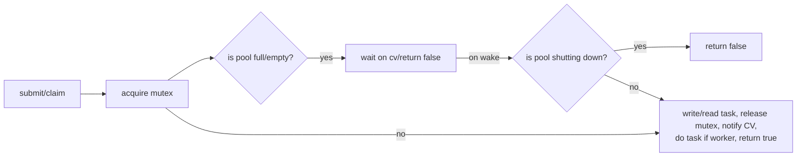
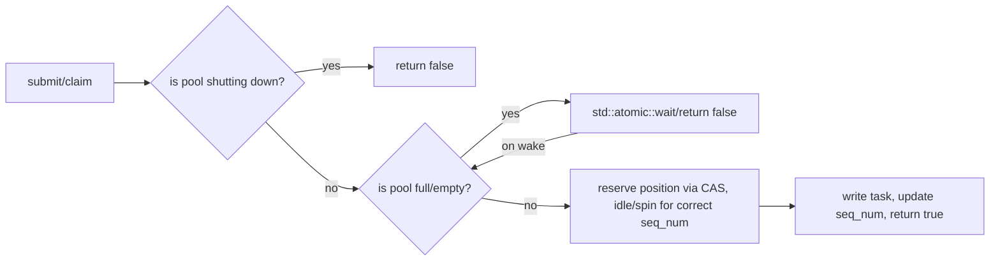
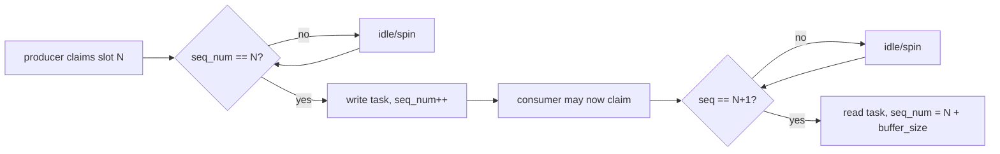
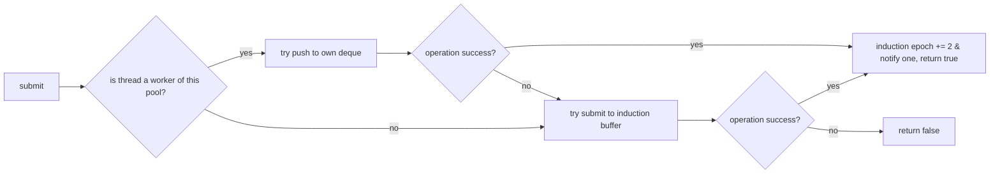
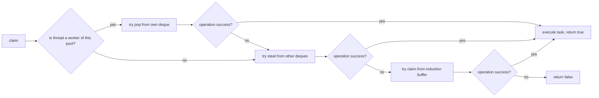
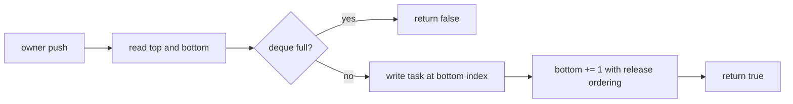
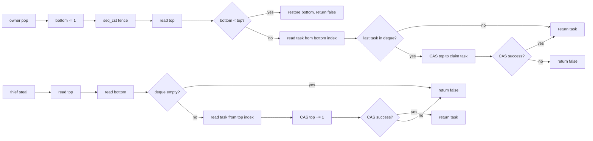

# thread-poollib

<!--toc:start-->
- [thread-poollib](#thread-poollib)
  - [Features](#features)
  - [`pool_type`](#pool_type)
  - [Architecture Diagrams](#architecture-diagrams)
  - [Usage](#usage)
  - [Benchmarks](#benchmarks)
  - [Notes, Limitations & Quirks](#notes-limitations-quirks)
<!--toc:end-->

Lightweight templated MPMC thread pool header-only library designed to improve performance
in multi-threaded applications. Also includes re-usable bounded MPMC queues in `include/mpmc.hpp`

## Features

- Supports 4 pool types (see below)

- **Templated** & **Header-only** for easy usage in projects

- **Compile-time function binding** and **fixed-size buffers** to minimise latency

- Includable via **CMake FetchContent** for easy dependency management

- **Graceful shutdowns** which block new submissions and allow workers to finish
execution safely

- **Debug-only atomic execution** guards that assert against concurrent or
duplicate task execution.

## `pool_type`

- `mutex` protects the buffer with a mutex

- `vyukov_spin` draws inspiration from Dimitri Vyukov's design on [1024cores](https://sites.google.com/site/1024cores/home/lock-free-algorithms/queues/bounded-mpmc-queue)

- `vyukov_idle` replaces sequence number waiting spins with std::atomic::wait()

- `work_stealing` uses a decentralized deque model + shared induction buffer

## Architecture Diagrams

### Mutex variant

#### Mutex submission/consumption workflow



### Vyukov variants

#### Vyukov submission/consumption workflow



#### Vyukov sequence number handling

Producers expect `seq_num` == i, while consumers expect `seq_num` == i + 1.
Producers increment `seq_num` by 1, while consumers increment it by
`task_buffer_len` - 1. This allows threads to distinguish between whether a
slot is being used by a consumer or producer, and between generations of producers
and consumers when head and tail pointers eventually wrap around the buffer.



### Work-stealing variant

The induction buffer is implemented as the Vyukov MPMC queue described above.

#### Submission workflow



##### Note on induction epoch

Submission increments it by 2 to reserve odd induction epoch values for the pool
shutdown state. If an idle worker observes there is no work to be done **AND** the
epoch has an **odd** value, it will exit from `worker_loop`, ensuring graceful shutdown.

#### Consumption workflow



#### Deque push

The deque follows the Chase-Lev convention: the owner pushes/pops from `bottom`,
while thieves steal from `top`. Only the owner modifies `bottom`.



#### Deque pop/steal



## Usage

Consider the function:

```cpp
int foo(const int *num1, const int *num2) {
    return *num1 * *num2;
}
```

The pool should be instantiated as

```cpp
// Sample values
#define THREADS 16
#define SLOTS 1024 

thread_pool<foo, THREADS, SLOTS> bar{}; // Defaults type to pool_type::mutex
```

Avoid constantly constructing and destroying pools as it creates and destroys threads.
More info of this overhead can be found in `benchmarks/ctor-dtor/README.md`

To queue tasks:

```cpp
tp_task<foo> task{&input_1, &input_2};

bar.submit(&task); // Blocks, only returns false if the pool is shutting down

task.is_result_ready.wait(false);

// task.result is now available for non-void returning functions
```

In recursive contexts, `try_claim` is available for users to avoid deadlocks:

```cpp
// Use acquire to ensure task is fully written to when we read it
while (!task.is_result_ready.load(std::memory_order_acquire)) {
    if (!bar.try_claim()) task.is_result_ready.wait(false);
}
```

### `wrapper` pattern

To use multiple functions for the thread pool, wrap them in a small wrapper function:

```cpp
inline int wrapper(int type, void *data) {
    switch (type) {
        case FUNC_1_TYPE: {
            auto args = static_cast<func_1_args*>(data);
            return func_1(args);
            break;
        }
        case FUNC_2_TYPE: {
            auto args = static_cast<func_2_args*>(data);
            return func_2(args);
            break;
        }
        default:
            assert(false && "Invalid wrapper type");
    }
}
```

With `func_N_args` being structs that help map each byte of `void *data` to each
argument expected. This obviously adds a small overhead per function call but is
typically negligible.

### `reset_flag()`

This function is necessary when re-using allocated memory without reconstructing
`tp_task` objects. It clears the execution guard state, ensuring that the assertion
does not spuriously throw on subsequent executions. In release builds, it is typically
compiled away due to the presence of the `NDEBUG` flag.

## Benchmarks

See `benchmarks/README.md`

> More benchmarks are planned. See issue #7

<a id="notes-limitations-quirks"></a>

## Notes, Limitations & Quirks

- Thread and Task buffers are statically sized at compile time

- YOU, the caller, are **responsible** for ensuring that task objects
passed in **remain alive** while workers compute them

- If using this pool in a recursive context, it is recommended to
heap allocate tasks. Stack use after returns can be caused by stack re-use

- Dynamically sized buffers and worker pools are **not** supported, but
may be added in a future patch

- Tasks **cannot** be cancelled

- Exceptions thrown by tasks are not handled, which may terminate worker threads

- Memory ordering has been tested for x86 and not other platforms with weaker guarantees

- Functions must have arguments (not planning to support those without arguments)
