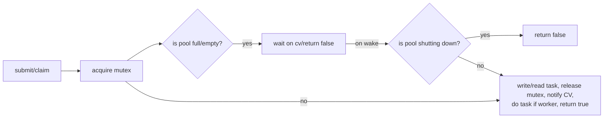
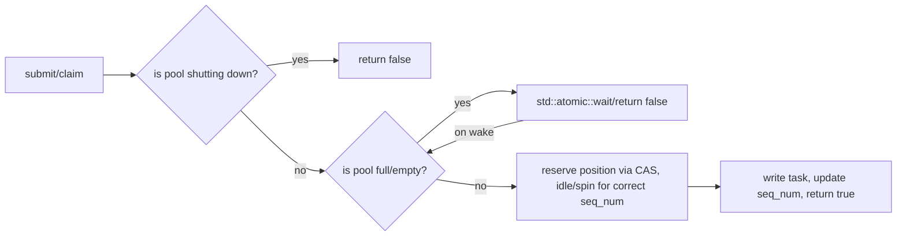
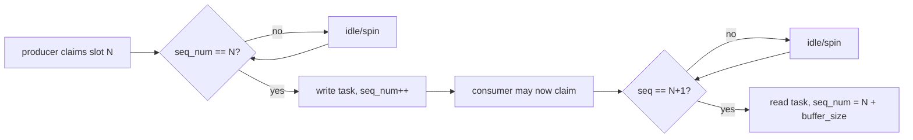

# thread-poollib

<!--toc:start-->
- [thread-poollib](#thread-poollib)
  - [Features](#features)
  - [`pool_type`](#pool_type)
  - [Architecture Diagrams](#architecture-diagrams)
  - [Usage](#usage)
  - [Benchmarks](#benchmarks)
  - [Notes, Limitations & Quirks](#notes-limitations-quirks)
<!--toc:end-->

Lightweight templated MPMC thread pool header-only library designed to improve performance
in multi-threaded applications. Also includes re-usable bounded MPMC queues in `include/mpmc.hpp`

## Features

- Supports 4 pool types (see below)

- **Templated** & **Header-only** for easy usage in projects

- **Compile-time function binding** and **fixed-size buffers** to minimise latency

- Includable via **CMake FetchContent** for easy dependency management

- **Graceful shutdowns** which block new submissions and allow workers to finish
execution safely

- **Debug-only atomic execution** guards that assert against concurrent or
duplicate task execution.

## `pool_type`

- `mutex` protects the buffer with a mutex

- `vyukov_spin` draws inspiration from Dimitri Vyukov's design on [1024cores](https://sites.google.com/site/1024cores/home/lock-free-algorithms/queues/bounded-mpmc-queue)

- `vyukov_idle` replaces sequence number waiting spins with std::atomic::wait()

- `work_stealing` uses a decentralized deque model + shared induction buffer for
external submissions.

## Architecture Diagrams

### Mutex variant

#### Mutex submission/consumption workflow



### Vyukov variants

#### Vyukov submission/consumption workflow



#### Vyukov sequence number handling

Producers expect `seq_num` == i, while consumers expect `seq_num` == i + 1.
Producers increment `seq_num` by 1, while consumers increment it by
`task_buffer_len` - 1. This allows threads to distinguish between whether a
slot is being used by a consumer or producer, and between generations of producers
and consumers when head and tail pointers eventually wrap around the buffer.



## Usage

Consider the function:

```cpp
int foo(const int *num1, const int *num2) {
    return *num1 * *num2;
}
```

The pool should be instantiated as

```cpp
// Sample values
#define THREADS 16
#define SLOTS 1024 

thread_pool<foo, THREADS, SLOTS> bar{}; // Defaults type to pool_type::mutex
```

Avoid constantly constructing and destroying pools as it creates and destroys threads.

To queue tasks:

```cpp
tp_task<foo> task{&input_1, &input_2};

bar.submit(&task); // Blocks, only returns false if the pool is shutting down

task.is_result_ready.wait(false);

// task.result is now available for non-void returning functions
```

In recursive contexts, `try_claim` is available for users to avoid deadlocks:

```cpp
// Use acquire to ensure task is fully written to when we read it
while (!task.is_result_ready.load(std::memory_order_acquire)) {
    if (!bar.try_claim()) task.is_result_ready.wait(false);
}
```

### `wrapper` pattern

To use multiple functions for the thread pool, wrap them in a small wrapper function:

```cpp
inline int wrapper(int type, void *data) {
    switch (type) {
        case FUNC_1_TYPE: {
            auto args = static_cast<func_1_args*>(data);
            return func_1(args);
            break;
        }
        case FUNC_2_TYPE: {
            auto args = static_cast<func_2_args*>(data);
            return func_2(args);
            break;
        }
        default:
            assert(false && "Invalid wrapper type");
    }
}
```

With `func_N_args` being structs that help map each byte of `void *data` to each
argument expected. This obviously adds a small overhead per function call but is
typically negligible.

### `reset_flag()`

This function is necessary when re-using allocated memory without reconstructing
`tp_task` objects. It clears the execution guard state, ensuring that the assertion
does not spuriously throw on subsequent executions. In release builds, it is typically
compiled away due to the presence of the `NDEBUG` flag.

## Benchmarks

### Vector Addition

All benchmarks were run on a Ryzen 7 8845HS (8C/16T where appropiate) with 1 million
ints per vector.

| Name            | Avg. Time ± S.D. (ms) |
| --------------- | --------------------- |
| Single-Threaded | 1.0 ± 0.4             |
| Mutex           | 2.4 ± 0.4             |
| Vyukov (idle)   | 2.5 ± 0.4             |
| Vyukov (spin)   | 2.3 ± 0.4             |
| Work-Stealing   | 2.2 ± 0.6             |

Overall, this demonstrates that introducing concurrency through the thread pool
implementations is ineffective for simple vector addition. The overhead of task
scheduling and synchronisation outweighs the benefits of parallel execution for
this regular, highly predictable workload. Thread pools may perform better on more
irregular workloads where the CPU has greater difficulty with branch prediction,
cache locality, or prefetching. GPU parallelisation is likely to outperform the
CPU due to the sheer volume of computation it provides, but this is outside the
scope of this project.

<a id="notes-limitations-quirks"></a>

## Notes, Limitations & Quirks

- Thread and Task buffers are statically sized at compile time

- YOU, the caller, are **responsible** for ensuring that task objects
passed in **remain alive** while workers compute them

- If using this pool in a recursive context, it is recommended to
heap allocate tasks. Stack use after returns can be caused by stack re-use

- Dynamically sized buffers and worker pools are **not** supported, but
may be added in a future patch

- Tasks **cannot** be cancelled

- Exceptions thrown by tasks are not handled, which may terminate worker threads

- Memory ordering has been tested for x86 and not other platforms with weaker guarantees
